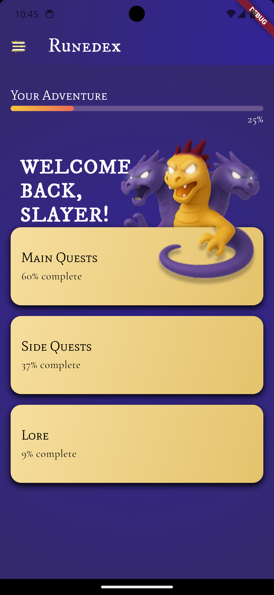
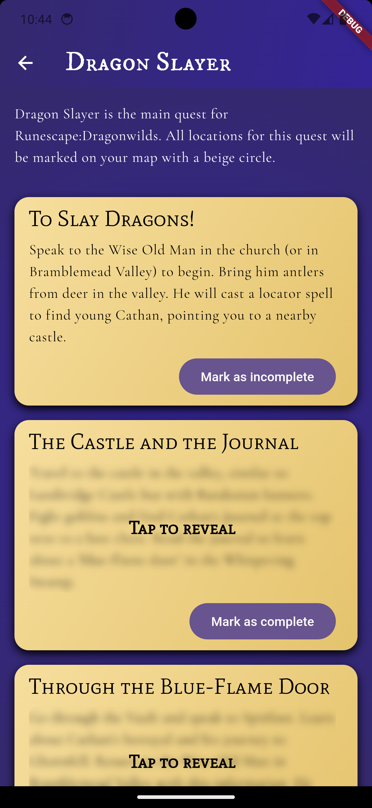
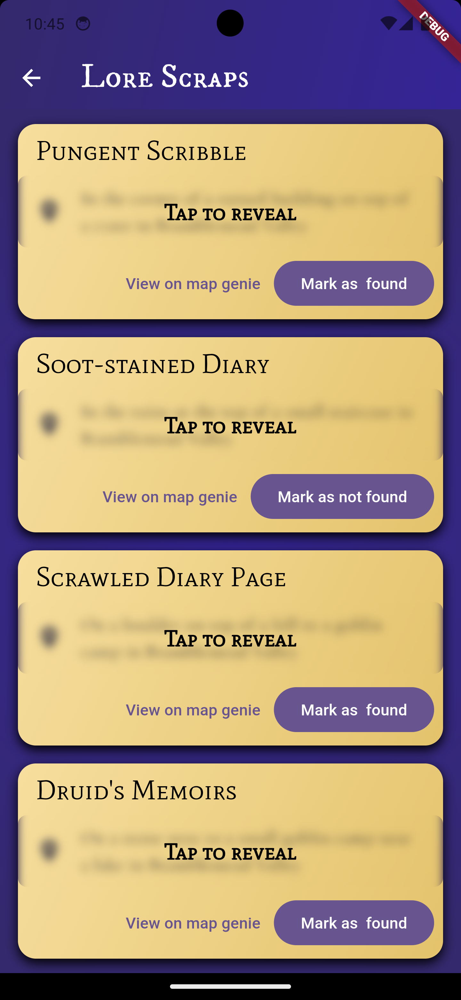

# Runedex

**Runedex** is a completion tracker companion app for **RuneScape Dragonwilds**. Keep track of your completed quests, side quests, and collectibles — and watch your completion percentage grow as you explore.

Whether you're aiming for 100% or just want to stay organized, Runedex helps you stay on top of your progress with a clean and simple interface.

---

## ✨ Features

- ✅ Track quests, side quests, and collectibles
- 📊 Live completion percentage
- 💾 All progress stored locally on your device
- 📱 Available on **Android** and **iOS**
- 🧭 Designed specifically for RuneScape fans

---

## 📸 Screenshots

### Home Screen

### Quest Details

### Progress Tracker

## 🚀 Installation

### 📱 Android
- Install from the [Google Play Store](#) *(coming soon)*

### 🍎 iOS
- Available on the App Store *(coming soon)*

---

## 🔒 Privacy Policy

Runedex does **not** collect personal data.  
You can view the full policy here:  
📄 [Privacy Policy](https://github.com/BradDoesCode/Rundex/wiki/Privacy-Policy)

---

## 🛠️ Built With

- [Flutter](https://flutter.dev/)
- Dart
- Local storage (e.g., Hive)
- Designed for both Android and iOS

---

## 💖 Support the Project

If you find **Runedex** helpful and want to support future updates, you can [buy me a coffee](https://buymeacoffee.com/braddoescode)!

---

## 🧾 License

This project is licensed under the [Apache 2.0](./LICENSE).

---

## 🙌 Contributing

Contributions, bug reports, and feature suggestions are welcome!  
Feel free to fork the repo and open a pull request.

---

## 📬 Contact

**Developer:** [Brad Barbrook]  
**Email:** [bradbarbrook@gmail.com]  
**GitHub:** [@BradDoesCode](https://github.com/BradDoesCode)

